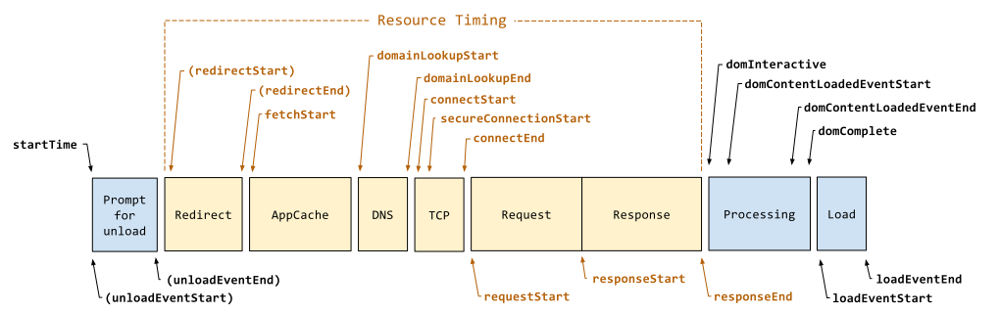

This extension measures page load time and displays it in the toolbar.
Navigation Timing API is used for precise measurement.

# Release 2.0
From page load time `2.0`, we offer the following features:
1. Use more friendly `Performance Timeline 2` APIs to replace `Navigation Timing 1`. Of course it is still compatible with lower than Chrome 64.
2. Add a new feature, you can get a number of redirect count.

In order to better understand the meaning of its various indicators, see the following figure:

# License

This project is licensed under the terms of the MIT license.
